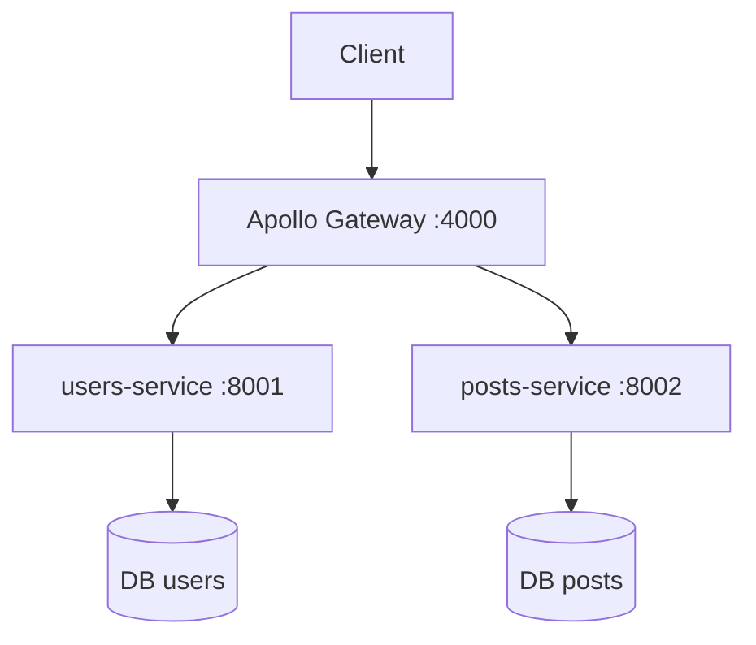
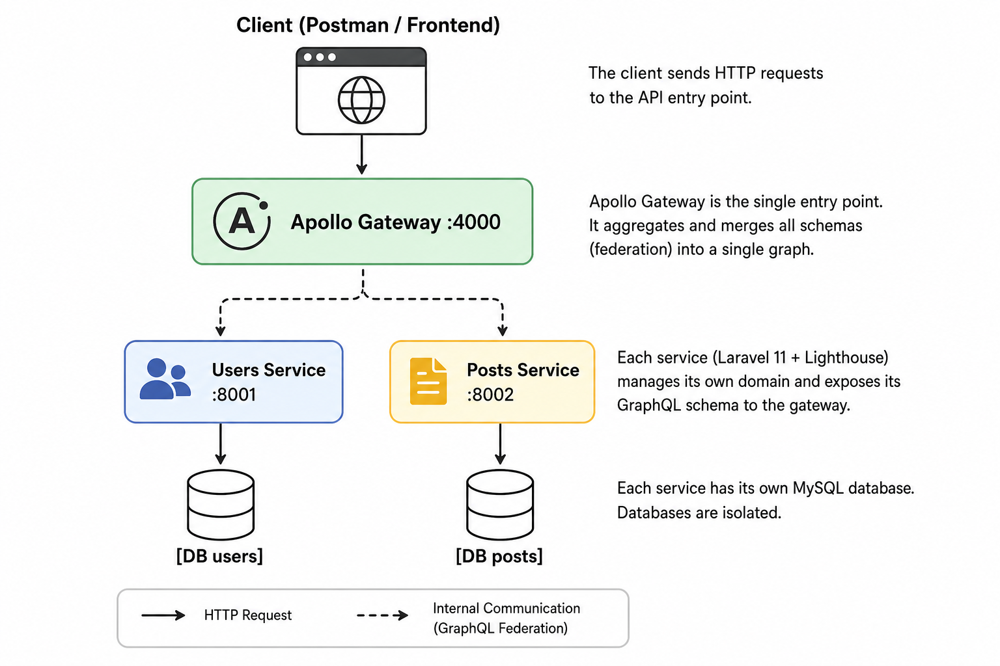

# mini-blog-federated

A small test project to experiment with **Apollo Federation** and **Laravel Lighthouse microservices**.

The idea was to split a basic blog into two independent services (users and posts), each with their own database, and have them communicate through an Apollo Gateway.

A post has an `author`, but the user data lives in a separate service. Apollo Federation handles the relationship automatically — the client just queries `author { name email }` and the gateway figures out the rest.

## Architecture




## Stack

- **Gateway** — Node.js, Apollo Gateway v2
- **Services** — PHP 8.3, Laravel 11, Lighthouse
- **Auth** — JWT stateless
- **Infra** — Docker, MySQL 8

## Getting Started

### Prerequisites

- PHP 8.3
- Composer
- Node.js 20+
- Docker & Docker Compose

### 1. Clone the repository

```bash
git clone https://github.com/your-username/mini-blog-federated.git
cd mini-blog-federated
```

### 2. Environment setup

```bash
cp users-service/.env.example users-service/.env
cp posts-service/.env.example posts-service/.env
cp gateway/.env.example gateway/.env
```

Fill in `DB_PASSWORD` and `JWT_SECRET` in each `.env`. The `JWT_SECRET` must be identical in both services.

### 3. Generate JWT secrets

```bash
cd users-service && php artisan jwt:secret
cd ../posts-service && php artisan jwt:secret
```

### 4. Install gateway dependencies

```bash
cd gateway && npm install
```

### 5. Start the project

```bash
docker compose up --build
```

### 6. Run migrations

```bash
docker compose exec users-service php artisan migrate
docker compose exec posts-service php artisan migrate
```

### 7. Query the API

```
http://localhost:4000/graphql
```


## Deployment

This project is deployed on [Railway](https://railway.app).

Each service runs as an independent container:

- `db-users` and `db-posts` — MySQL 8 managed databases
- `users-service` and `posts-service` — Laravel 11 apps built from their respective Dockerfiles
- `gateway` — Node.js Apollo Gateway, the single entry point

Services communicate privately through Railway's internal network. Only the gateway is exposed publicly.

Environment variables (database credentials, JWT secrets, service URLs) are managed directly in the Railway dashboard.

## Example Queries

### Register

```bash
curl -X POST https://your-gateway-url/graphql \
  -H "Content-Type: application/json" \
  -d '{"query":"mutation { register(name: \"Kanon\", email: \"kanon@test.com\", password: \"secret\") { token user { id name } } }"}'
```

### Login

```bash
curl -X POST https://your-gateway-url/graphql \
  -H "Content-Type: application/json" \
  -d '{"query":"mutation { login(email: \"kanon@test.com\", password: \"secret\") { token } }"}'
```

### Create a post (requires token)

```bash
curl -X POST https://your-gateway-url/graphql \
  -H "Content-Type: application/json" \
  -H "Authorization: Bearer YOUR_TOKEN" \
  -d '{"query":"mutation { createPost(title: \"Hello World\", body: \"My first post\") { id title authorId author { name email } } }"}'
```

### List all posts with authors

```bash
curl -X POST https://your-gateway-url/graphql \
  -H "Content-Type: application/json" \
  -d '{"query":"{ posts { id title createdAt author { name email } } }"}'
```